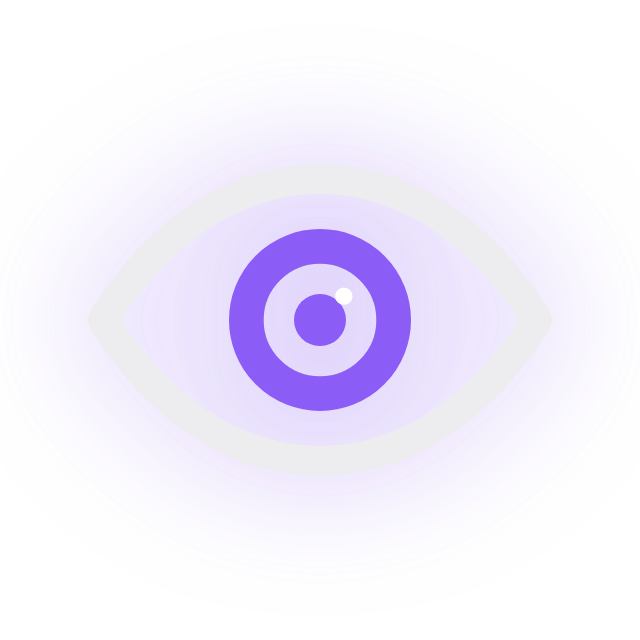

<div align="center">



# Argus

**the watchman whose eyes never all close**

[](https://github.com/duytrandt04-afk/argus/releases/latest)
[](LICENSE)
[](https://github.com/duytrandt04-afk/argus/stargazers)
[](https://getargus.org)

[Quick start](#quick-start) · [What it looks like](#what-it-looks-like) · [Hook scripts](my-custom-hook-scripts/) · [Docs](#documentation) · [getargus.org](https://getargus.org)

</div>

---

**The hook control center for AI coding agents.** Hooks are how you govern what
Claude Code and Codex can do — block dangerous commands, protect secrets, enforce
branch policy, get notified. But managing them means hand-editing JSON, testing
them means waiting for a live agent to misbehave, and good scripts are scattered
across a thousand gists. Argus fixes all three, locally:

- **Hook management** — a config editor with one-click presets for Claude Code and
  Codex. No JSON surgery; argus-managed entries are tagged and reversible.
- **Hook simulator** — run any hook command or script against a realistic synthetic
  payload for any event type, and inspect stdout/stderr/exit code/duration *before*
  an agent ever fires it. The missing debugger for the hook ecosystem.
- **Public script collection** — [`my-custom-hook-scripts/`](my-custom-hook-scripts/)
  ships battle-tested, zero-dependency guardrails free for everyone: dangerous-command
  blocker, secrets protection, branch guard, auto-format with lint feedback,
  prompt-injection scanner, webhook notifications, and more. Every script works
  with Claude Code and Codex.

Backing it up: a **live observability layer** — every hook payload is normalized to a
canonical event model, persisted to SQLite, and streamed to a real-time dashboard
(event feed, session explorer, usage and cost stats). You see your hooks — and your
agents — actually working. No cloud, no telemetry, your data stays local.

## Quick start

```bash
curl -fsSL https://raw.githubusercontent.com/duytrandt04-afk/argus/main/install.sh | bash
```

> **Requirements:** Node.js 18+, curl, tar — no Go or pnpm needed.
>
> The installer downloads a pre-built binary for your OS and arch, wires the Claude Code
> `SessionStart` hook, and places `argus` in `~/.argus/bin`.

Open **http://127.0.0.1:10804** after your next Claude Code or Codex session starts.

Then follow [docs/quickstart.md](docs/quickstart.md) to verify your first event.

## What it looks like

The dashboard is one local panel over your agents: a live event feed, a session
waterfall, token and cost stats, the hooks config editor, and the built-in hook
simulator. Take the full visual tour at **[getargus.org](https://getargus.org)**.

| Surface | What it does |
| ------- | ------------ |
| **Hooks config + simulator** | One-click presets; fire a synthetic payload at any hook and read stdout/stderr/exit code before a live agent runs it. |
| **Event feed** | Every normalized tool call streamed over SSE, sub-100ms from hook to browser. |
| **Sessions** | Tool calls grouped per session and drawn as a waterfall. |
| **Dashboard** | Token and cost roll-ups per session, day, and model — computed locally. |
| **Script collection** | Free zero-dependency guardrails in [`my-custom-hook-scripts/`](my-custom-hook-scripts/). |

## Uninstall

```bash
curl -fsSL https://raw.githubusercontent.com/duytrandt04-afk/argus/main/uninstall.sh | bash
```

Stops the server, removes binaries and scripts, unwires hooks from `~/.claude/settings.json`, and optionally deletes your data.

## Documentation

- [docs/hooks.md](docs/hooks.md) - hook management, presets, and the hook simulator
- [my-custom-hook-scripts/](my-custom-hook-scripts/) - the public hook script collection
- [docs/quickstart.md](docs/quickstart.md) - first-event walkthrough (under 10 minutes)
- [docs/install.md](docs/install.md) - full install reference, support matrix, data lifecycle
- [docs/privacy.md](docs/privacy.md) - capture categories, ignore controls, export implications
- [docs/security.md](docs/security.md) - local threat model and remote-sharing posture
- [docs/releases.md](docs/releases.md) - release runbook and conventional commit format

## Contributing

See [CONTRIBUTING.md](CONTRIBUTING.md).

## License

[LICENSE](LICENSE)
